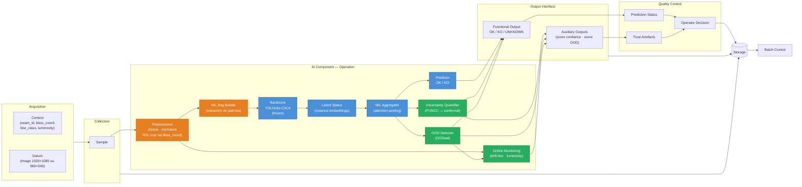
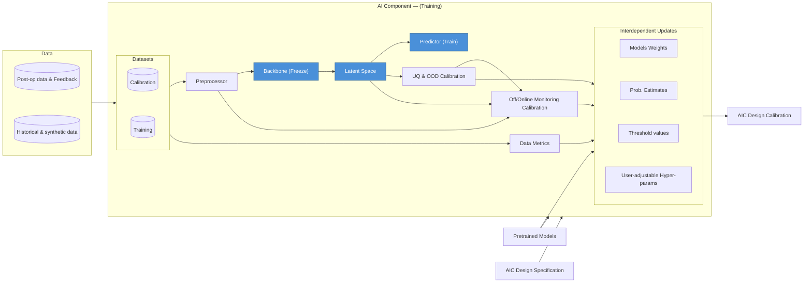
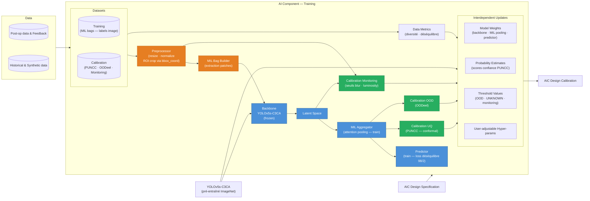
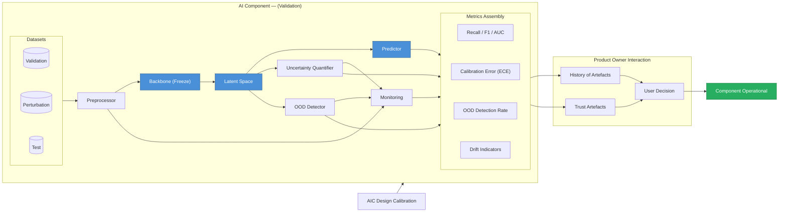
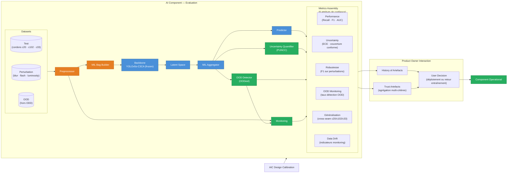

# AI Component Architecture

This document describes the architecture of the AI component for the Welding Quality Detection Challenge.

blk

## Overview

The AI component is designed to detect welding defects from visual and sensor data. It consists of a pre-processing pipeline, a deep learning model for defect classification/localization, and a post-processing module for quality reporting.

## 1. Operation Architecture (Inference)
The operation phase describes how the component behaves in a real-time environment.

```mermaid
flowchart LR

  classDef blue fill:#4a90d9,stroke:#2c5f8a,color:#fff
  classDef orange fill:#e67e22,stroke:#b35a0a,color:#fff
  classDef green fill:#27ae60,stroke:#1a7a42,color:#fff

  subgraph ACQ["Acquisition"]
    direction TB
    CONTEXT["Context"]
    CONTEXT ~~~ DATUM
    DATUM["Datum"]
  end

  subgraph COLLECTION["Collection"]
    direction TB
    SAMPLE["Sample"]
  end

  ACQ --> SAMPLE
  SAMPLE --> PREP_OP

  subgraph OPERATION["AI Component — Operation"]
    direction LR
    PREP_OP["Preprocessor"]
    PREP_OP --> BACKBONE_OP["Backbone"]
    BACKBONE_OP --> LATENT_OP["Latent Space"]
    LATENT_OP --> PREDICTOR_OP["Predictor"]
    LATENT_OP --> UQ_OP["Uncertainty Quantifier"]
    LATENT_OP --> OOD_OP["OOD Detector"]

    PREP_OP --> MONITOR_OP["Online Monitoring"]
    OOD_OP --> MONITOR_OP
    UQ_OP --> MONITOR_OP
    LATENT_OP --> MONITOR_OP
    PREP_OP --> OOD_OP

    PREDICTOR_OP --> METRICS_OP["Metrics' Assembly"]
    UQ_OP --> INNER
    OOD_OP --> INNER
    MONITOR_OP --> INNER

    class BACKBONE_OP,LATENT_OP,PREDICTOR_OP blue
    class PREP_OP orange
    class MONITOR_OP,UQ_OP,OOD_OP green
    
    subgraph INNER[" "]
      direction TB
      FUNC_OUT["Functional Output"]
      AUX_OUT["Auxiliary Outputs"]
    end
  end

  STORAGE[("Storage")]
  BATCH["Batch Control"]

  INNER --> STORAGE
  COLLECTION --> STORAGE
  STORAGE --> BATCH

  subgraph OP_INTERACT["Operator Interaction"]
    direction TB
    PRED_STATUS["Prediction Status"]
    TRUST_ARTEFACTS["Trust Artefacts"]
    USER_DEC_OP["User Decision"]
  end

  USER_DEC_OP --> STORAGE
  subgraph QC["Quality Control"]
    direction TB
    BATCH["Batch Control"]
    TRUST_ARTEFACTS["Trust Artefacts"]
    USER_DEC_OP["User Decision"]
  end

  METRICS_OP --> PRED_STATUS
  INNER --> TRUST_ARTEFACTS
  PRED_STATUS --> USER_DEC_OP
  TRUST_ARTEFACTS --> USER_DEC_OP
```

**PROPOSITION OPUS:**

## 2. Training Architecture
The training phase focuses on model construction and optimization.

**PROPOSITION OPUS:**

## 3. Evaluation Architecture

The evaluation phase validates the model's performance on unseen data.

**PROPOSITION OPUS:**

## Software Constituents

- **ML Model_1** : xxx
- **ML Model_2** : xxx
- **ML Model_x** : xxx
- **Pre-processor**: xxx
- **Post-processor**: xxx

### ML Model_1

