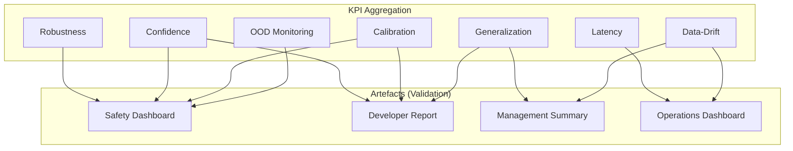
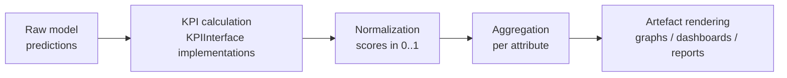

# Artefacts and Validation

This document describes how KPIs are aggregated and presented for final validation by stakeholders.

## 1. Aggregated KPIs for Confidence Demonstration

Artefacts are filtered and aggregated representations of the component's performance.

### Example: Robustness by Weld Type

- **Artefact**: A bar graph showing the F1-score for different welding scenarios (e.g., T-joint vs Butt-joint) in both "Normal" and "Flash" conditions.
- **Aggregation Method**: Grouping test samples by `weld_type` and calculating the mean F1-score.
- **Audience**: Quality Assurance (QA) and Industrial Supervisors.

### Example: Confidence Distribution Map

- **Artefact**: A heatmap showing where the model typically has lower confidence in its predictions.
- **Aggregation Method**: Spatial aggregation of `probability_map` across a test set.
- **Audience**: AI Developers for model refinement.

### Example: Latency Profile

- **Artefact**: A boxplot of `latency_ms` per `hardware_target` and `batch_size`, with the 50th, 95th and 99th percentiles annotated against the operational SLA (200 ms target).
- **Aggregation Method**: Per-hardware quantile aggregation across the operational evaluation set.
- **Audience**: Production Engineers, Operations Lead.

### Example: Calibration Reliability Diagram

- **Artefact**: A reliability diagram (predicted-vs-empirical confidence) accompanied by the Expected Calibration Error (ECE).
- **Aggregation Method**: Binning predictions by confidence interval and computing per-bin accuracy.
- **Audience**: AI Developers, Safety Officer.

### Example: OOD Detection Report

- **Artefact**: ROC curves and AUROC tables for synthetic vs. real out-of-distribution detection benchmarks.
- **Aggregation Method**: Per-evaluation-set AUROC aggregation, with a comparative summary across `OOD_Syn` and `OOD_Real`.
- **Audience**: Safety Officer, AI Developers.

### Example: Drift Trend Dashboard

- **Artefact**: A time-series dashboard showing rolling drift scores (`drift_score`, `OP_d`, `OOD_d`) over a configurable operational window, with alert thresholds.
- **Aggregation Method**: Sliding-window aggregation of operational predictions versus a reference distribution.
- **Audience**: Operations Lead, MLOps Engineer.

### Example: Generalization Scorecard

- **Artefact**: A scorecard contrasting `OP_g` and `ML_g` across designed evaluation scenarios (varied weld types, illumination, viewpoints), with degradation flagged in red.
- **Aggregation Method**: Per-scenario aggregation followed by relative comparison to the reference evaluation set.
- **Audience**: AI Developers, Project Manager.

## 2. Intended Usage and Stakeholders

| Artefact | Stakeholder | Objective |
|----------|-------------|-----------|
| Robustness Report | Safety Officer | Validate component reliability under lighting changes. |
| Defect Heatmap | Maintenance Team | Optimize robot movement to avoid poor-visibility areas. |
| KPI Evolution | Project Manager | Track performance improvement across training iterations. |
| Latency Profile | Production Engineer | Confirm the component meets real-time operational SLAs. |
| Calibration Diagram | Safety Officer | Confirm that confidence scores can be trusted for downstream decisions. |
| OOD Detection Report | Safety Officer | Demonstrate the component flags inputs outside the ODD. |
| Drift Trend Dashboard | Operations Lead | Detect when the operational distribution diverges from training data. |
| Generalization Scorecard | AI Developer | Identify scenarios where the model under-performs. |
| Trust Score Summary | Steering Committee | Provide a single comparable trust score across submissions. |

## 3. Visual Representation (Mock)

## 4. Phase Usage

- **Construction Dataset**: Data diversity reports, sample-coverage matrices.
- **Training**: Training loss and validation accuracy curves, calibration diagrams on the validation split.
- **Evaluation**: Final F1-score report, confusion matrix, OOD detection report, generalization scorecard, latency profile.
- **Operation**: Real-time confidence monitoring, drift trend dashboard, latency SLA monitoring, OOD alerts.

## 5. Trust-Attribute Coverage

Each artefact contributes evidence for one or more trust attributes of the ML-Trustworthy evaluation protocol. The matrix below indicates which artefact informs which attribute.

| Artefact | Performance | Uncertainty | Robustness | OOD Monitoring | Generalization | Data-Drift |
|----------|:---:|:---:|:---:|:---:|:---:|:---:|
| Robustness Report | | | X | | | |
| Defect Heatmap | X | X | | | | |
| KPI Evolution | X | | X | | X | |
| Latency Profile | X | | | | | |
| Calibration Diagram | | X | | | | |
| OOD Detection Report | | | | X | | |
| Drift Trend Dashboard | | | | | | X |
| Generalization Scorecard | X | | | | X | |
| Trust Score Summary | X | X | X | X | X | X |

The Trust Score Summary is the top-level artefact: it consolidates the per-attribute KPIs into a single rescaled score (cf. the aggregation methodology in the project evaluation protocol).

## 6. Artefact Generation Pipeline

The pipeline that turns raw KPI outputs into validation artefacts follows four stages:

Each stage is reproducible from the raw predictions, which guarantees that any artefact can be regenerated for audit purposes.
