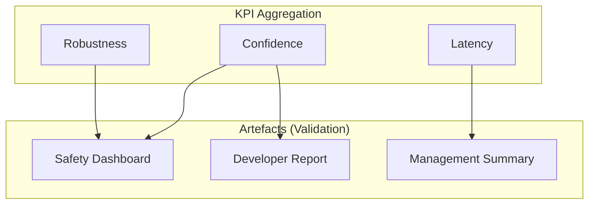

# Artefacts and Validation

This document describes how KPIs are aggregated and presented for final validation by stakeholders.

## 1. Aggregated KPIs for Confidence Demonstration

Artefacts are filtered and aggregated representations of the component's performance.

### Example: Robustness by Weld Type

- **Artefact**: A bar graph showing the F1-score for different welding scenarios (e.g., T-joint vs Butt-joint) in both "Normal" and "Flash" conditions.
- **Aggregation Method**: Grouping test samples by `weld_type` and calculating the mean F1-score.
- **Audience**: Quality Assurance (QA) and Industrial Supervisors.

### Example: Confidence Distribution Map

- **Artefact**: A heatmap showing where the model typically has lower confidence in its predictions.
- **Aggregation Method**: Spatial aggregation of `probability_map` across a test set.
- **Audience**: AI Developers for model refinement.

## 2. Intended Usage and Stakeholders
| Artefact | Stakeholder | Objective |
|----------|-------------|-----------|
| Robustness Report | Safety Officer | Validate component reliability under lighting changes. |
| Defect Heatmap | Maintenance Team | Optimize robot movement to avoid poor-visibility areas. |
| KPI Evolution | Project Manager| Track performance improvement across training iterations. |

## 3. Visual Representation (Mock)

## 4. Phase Usage

- **Construction Dataset**: Data diversity reports.
- **Training**: Training loss and validation accuracy curves.
- **Evaluation**: Final F1-score report, confusion matrix.
- **Operation**: Real-time confidence monitoring and drift detection.
