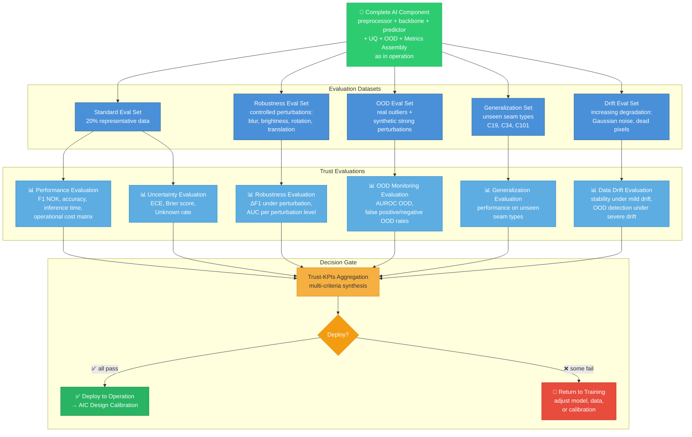

# AI Component Architecture

This document describes the architecture of the AI component for the Welding Quality Detection Challenge (Renault / Confiance.ai).

## Overview

The AI component is designed to detect welding defects from images captured by production line cameras (OP 120 station). It consists of a pre-processing pipeline with quality control, a convolutional neural network (CNN) for classification, auxiliary modules for uncertainty estimation and out-of-distribution (OOD) detection, and a metrics assembly module for final decision-making.

The component must classify each weld image into three classes: **OK**, **NOK** (defect detected), or **Unknown** (indecision requiring manual verification by the operator).

## 1. Operation Architecture (Inference)

The operation phase describes how the component behaves when deployed in production, in real time on the production line.

### Inputs

- **Raw image**: weld image (RGB, variable resolution) captured by the OP 120 station camera
- **Context (metadata)**: timestamp, weld seam type (C20 / C33 / C102), station/camera ID, weld criticality level

### Processing Pipeline

1. **Preprocessor**: prepares the image for the model and performs an initial quality check
   - Resizing to a fixed size
   - Pixel normalization (value scaling)
   - Colorimetric conversion (RGB → grayscale, choice to be justified experimentally)
   - Exposure / brightness correction to stabilize lighting variations
   - Upstream quality control: if the image is too blurry or too dark, it is rejected and the system directly returns **Unknown** with an "unusable image" flag, triggering an alert for manual verification

2. **Backbone (CNN)**: convolutional neural network that extracts visual features from the preprocessed image and produces a compressed representation vector (latent space). Must be lightweight enough to meet the inference constraint of < 1/12s per image. The choice between training from scratch or fine-tuning from a pre-trained model is to be determined experimentally.

3. **Predictor**: classification layers that take the latent vector as input and produce per-class probabilities (P(OK), P(NOK), P(Unknown)).

4. **Uncertainty Quantifier (UQ)**: module that assesses prediction reliability from the latent space. If uncertainty exceeds a threshold defined during calibration, the prediction is switched to Unknown. Handles borderline cases where the model hesitates between classes.

5. **OOD Detector**: module that checks whether the image belongs to the known domain (in-distribution) from the latent space. Detects out-of-distribution inputs (dirty camera, object in front of the lens, unknown weld seam type, severe hardware degradation). If OOD is detected, the prediction is switched to Unknown regardless of the predictor output.

6. **Metrics' Assembly**: decision module that combines outputs from the predictor, UQ and OOD Detector, and applies decision rules:
   - OOD detected → Unknown
   - Uncertainty > threshold → Unknown
   - Image rejected by preprocessor → Unknown + "unusable image" flag
   - Otherwise → predicted class (OK or NOK)
   - Thresholds are adjusted based on weld criticality (a critical weld triggers stricter thresholds to minimize false negatives)

7. **Online Monitoring**: continuously records predictions, confidence scores, OOD scores and performance indicators. Feeds a storage system for batch quality control (Batch Control), which detects systemic issues (e.g. abnormally high Unknown rate on a specific weld seam type).

### Outputs

- **Prediction Status**: final class (OK / NOK / Unknown) displayed to the operator on the OP 120 screen
- **Trust Artefacts**: confidence scores, OOD score, decision rationale (e.g. "Unknown — high uncertainty" or "Unknown — unusable image")
- **Operator Feedback**: the operator can correct the system's decision (e.g. system says OK but operator detects a visual defect). This feedback is stored for continuous model improvement.

### Architecture Diagram (Operation)

```mermaid
graph LR
    subgraph Acquisition
        IMG[📷 Raw RGB Image<br/>Variable resolution]
        CTX[📋 Context<br/>timestamp, seam type C20/C33/C102,<br/>camera ID, weld criticality]
    end

    subgraph Preprocessor
        RESIZE[Resize to fixed size]
        NORM[Pixel normalization<br/>scale to 0-1]
        COLOR[RGB → Grayscale<br/>choice to justify experimentally]
        EXPO[Exposure correction<br/>stabilize lighting variations]
        QC{Image Quality Check<br/>blur & brightness thresholds}
    end

    subgraph "AI Component"
        BACKBONE[🧠 Backbone CNN<br/>lightweight, inference < 1/12s<br/>from scratch or fine-tuned TBD]
        LS[Latent Space<br/>compressed feature vector]
        PRED[Predictor<br/>P OK / P NOK / P Unknown]
        UQ[Uncertainty Quantifier<br/>entropy on probabilities<br/>MC Dropout / Conformal TBD]
        OOD[OOD Detector<br/>Mahalanobis distance<br/>in latent space]
    end

    subgraph "Metrics Assembly"
        CRIT[Criticality adjustment<br/>stricter thresholds on critical welds]
        RULES{Decision Rules<br/>OOD detected → Unknown<br/>Uncertainty > threshold → Unknown<br/>Unusable image → Unknown + alert<br/>Otherwise → predicted class}
        FO[✅ Functional Output<br/>Final class: OK / NOK / Unknown]
        AO[📊 Auxiliary Outputs<br/>confidence score, OOD score,<br/>decision rationale]
    end

    subgraph "Operator Interaction"
        SCREEN[🖥️ OP 120 Display<br/>class + confidence + rationale]
        FB[🔄 Operator Feedback<br/>confirm or correct prediction<br/>→ stored for retraining]
    end

    subgraph Monitoring
        MON[Online Monitoring<br/>track predictions & indicators<br/>detect sudden Unknown spikes]
        STORAGE[(Storage<br/>predictions, scores,<br/>feedback, images)]
        BATCH[Batch Control<br/>systemic issue detection<br/>per seam type analysis]
    end

    IMG --> RESIZE --> NORM --> COLOR --> EXPO --> QC
    QC -->|✅ image OK| BACKBONE
    QC -->|❌ unusable image| RULES
    BACKBONE --> LS
    LS --> PRED
    LS --> UQ
    LS --> OOD
    PRED --> RULES
    UQ --> RULES
    OOD --> RULES
    CTX --> CRIT
    CRIT --> RULES
    RULES --> FO
    RULES --> AO
    FO --> SCREEN
    AO --> SCREEN
    SCREEN --> FB
    FO --> MON
    AO --> MON
    MON --> STORAGE
    STORAGE --> BATCH
    FB --> STORAGE

    style IMG fill:#4A90D9,stroke:#2C5F8A,color:#fff
    style CTX fill:#4A90D9,stroke:#2C5F8A,color:#fff
    style RESIZE fill:#5DADE2,stroke:#2E86C1,color:#fff
    style NORM fill:#5DADE2,stroke:#2E86C1,color:#fff
    style COLOR fill:#5DADE2,stroke:#2E86C1,color:#fff
    style EXPO fill:#5DADE2,stroke:#2E86C1,color:#fff
    style QC fill:#F39C12,stroke:#D68910,color:#fff
    style BACKBONE fill:#2ECC71,stroke:#27AE60,color:#fff
    style LS fill:#A3E4D7,stroke:#1ABC9C,color:#333
    style PRED fill:#2ECC71,stroke:#27AE60,color:#fff
    style UQ fill:#E74C3C,stroke:#C0392B,color:#fff
    style OOD fill:#E74C3C,stroke:#C0392B,color:#fff
    style CRIT fill:#F5B041,stroke:#D68910,color:#333
    style RULES fill:#F5B041,stroke:#D68910,color:#333
    style FO fill:#28B463,stroke:#1E8449,color:#fff
    style AO fill:#85C1E9,stroke:#2E86C1,color:#333
    style SCREEN fill:#8E44AD,stroke:#6C3483,color:#fff
    style FB fill:#8E44AD,stroke:#6C3483,color:#fff
    style MON fill:#5D6D7E,stroke:#2C3E50,color:#fff
    style STORAGE fill:#5D6D7E,stroke:#2C3E50,color:#fff
    style BATCH fill:#5D6D7E,stroke:#2C3E50,color:#fff
```

## 2. Training Architecture

The training phase describes how the AI component is built, from raw data to a calibrated model ready for deployment.

### Data Inputs

- **Historical data**: Renault welding dataset (22,753 images, 3 seam types: C20/C33/C102, highly imbalanced: 98% OK / 2% KO)
- **Synthetic data**: generated through data augmentation to address class imbalance and improve robustness
- **Post-operation feedback**: operator corrections from production (stored during operation phase), integrated in future retraining cycles

### Data Split

The dataset is split into distinct subsets with specific roles:
- **Training set**: model learning (~60%)
- **Validation set**: hyperparameter tuning and early stopping (~10%)
- **Calibration set**: threshold calibration for UQ, OOD and Metrics Assembly decision rules (~10%)
- **Evaluation set**: final performance assessment before deployment (~20%)

### Preprocessing (Training mode)

Same pipeline as operation (resize, normalize, exposure correction) plus:
- **Data augmentation** to improve robustness: blur variations, brightness/contrast shifts, rotations (-10° to +10°), translations (up to ~20px), simulated sensor noise
- **Class balancing**: oversampling of KO class to address the 98/2 imbalance
- **Data cleaning**: removal of mislabeled or low-quality samples identified during exploratory analysis

⚠️ **Risks of data augmentation to be adressed** : overfitting on generated images, lack of diversity, synthetic artefacts, calibration biais

### Training Pipeline

1. **Backbone (CNN)**: trained on augmented dataset to extract robust visual features. Choice between training from scratch or fine-tuning a pre-trained model (to be determined experimentally). Backbone weights may be frozen progressively during training (freeze strategy).

2. **Latent Space (Fine-tune)**: intermediate representation is refined during training to produce discriminative features for the welding classification task.

3. **Predictor (Train)**: classification head trained jointly with the backbone. Objective function: weighted cross-entropy loss (higher weight on KO class to penalize false negatives, aligned with the top priority requirement).

4. **UQ & OOD Calibration**: once the backbone and predictor are trained, the calibration set is used to:
   - Calibrate uncertainty thresholds (at what uncertainty level do we switch to Unknown?)
   - Calibrate OOD detection boundaries in the latent space (what is the "normal" distribution of known data?)
   - These are not trained jointly with the model — they are calibrated post-training

5. **Offline Monitoring Calibration**: define monitoring baselines and alert thresholds based on validation set statistics (expected Unknown rate, expected confidence distribution per seam type)

6. **Data Metrics**: computed throughout training to track data quality — class distribution, augmentation effectiveness, annotation consistency

### Training Criteria & Stop Conditions

- **Primary metric**: F1-score on KO class (validation set)
- **Secondary metrics**: overall accuracy, recall NOK, ECE (calibration error)
- **Early stopping**: triggered when validation F1-score on KO class does not improve for N consecutive epochs
- **Inference time check**: model must meet < 1/12s per image constraint on target hardware

### Outputs (Interdependent Updates)

- **Model weights**: trained backbone + predictor weights
- **Probability estimates**: calibrated probability distributions
- **Threshold values**: UQ and OOD thresholds, decision rules for Metrics Assembly
- **User-adjustable hyperparameters**: criticality-dependent threshold levels
- **History of artefacts**: training curves, validation metrics per epoch, data quality reports

All outputs feed into the **AIC Design Calibration**, which packages the trained and calibrated component for deployment in operation.

```mermaid
graph LR
    subgraph "Data Sources"
        HIST[(Historical Data<br/>22,753 images<br/>98% OK / 2% KO)]
        SYNTH[Synthetic Data<br/>augmentation & balancing]
        POSTOP[Post-op Feedback<br/>operator corrections]
    end

    subgraph "Data Split"
        SPLIT{Split<br/>Train 60% / Val 10%<br/>Calib 10% / Eval 20%}
        TRAIN_SET[Training Set]
        VAL_SET[Validation Set]
        CALIB_SET[Calibration Set]
        PERTURB[Perturbation Set<br/>blur, brightness,<br/>rotation, translation]
    end

    subgraph "Preprocessing - Training Mode"
        PREP[Preprocessor<br/>resize, normalize,<br/>exposure correction]
        AUG[Data Augmentation<br/>blur, brightness, rotation,<br/>translation, noise]
        BAL[Class Balancing<br/>oversample KO class]
        CLEAN[Data Cleaning<br/>remove mislabeled samples]
        DMET[Data Metrics<br/>class distribution,<br/>annotation quality]
    end

    subgraph "Model Training"
        BACKBONE_T[🧠 Backbone CNN<br/>from scratch or fine-tuned TBD<br/>progressive freeze strategy]
        LS_T[Latent Space<br/>fine-tune]
        PRED_T[Predictor<br/>weighted cross-entropy loss<br/>penalize false negatives]
    end

    subgraph "Calibration"
        UQ_CAL[UQ Calibration<br/>uncertainty thresholds]
        OOD_CAL[OOD Calibration<br/>latent space boundaries]
        MON_CAL[Monitoring Calibration<br/>baselines & alert thresholds]
    end

    subgraph "Training Outputs"
        WEIGHTS[Model Weights<br/>backbone + predictor]
        PROBS[Probability Estimates<br/>calibrated distributions]
        THRESH[Threshold Values<br/>UQ, OOD, decision rules]
        HYPER[User-adjustable Params<br/>criticality thresholds]
        ARTEF[📊 History of Artefacts<br/>training curves, metrics,<br/>data quality reports]
    end

    subgraph "Validation Loop"
        STOP{Stop Criteria<br/>F1 KO class plateau<br/>inference time < 1/12s}
        TRUST[Trust Artefacts<br/>validation metrics per epoch]
    end

    subgraph "Deployment"
        CALIB_OUT[🔧 AIC Design Calibration<br/>→ Operation Architecture]
    end

    HIST --> SPLIT
    SYNTH --> SPLIT
    POSTOP --> SPLIT
    SPLIT --> TRAIN_SET
    SPLIT --> VAL_SET
    SPLIT --> CALIB_SET
    SPLIT --> PERTURB

    TRAIN_SET --> PREP --> AUG --> BAL --> CLEAN
    CLEAN --> DMET
    CLEAN --> BACKBONE_T --> LS_T --> PRED_T

    VAL_SET --> STOP
    PRED_T --> STOP
    STOP -->|continue| BACKBONE_T
    STOP -->|stop| WEIGHTS
    STOP --> TRUST

    CALIB_SET --> UQ_CAL
    CALIB_SET --> OOD_CAL
    CALIB_SET --> MON_CAL
    LS_T --> UQ_CAL
    LS_T --> OOD_CAL

    WEIGHTS --> CALIB_OUT
    UQ_CAL --> PROBS --> CALIB_OUT
    OOD_CAL --> THRESH --> CALIB_OUT
    MON_CAL --> CALIB_OUT
    TRUST --> ARTEF
    DMET --> ARTEF
    ARTEF --> CALIB_OUT
    HYPER --> CALIB_OUT

    style HIST fill:#4A90D9,stroke:#2C5F8A,color:#fff
    style SYNTH fill:#4A90D9,stroke:#2C5F8A,color:#fff
    style POSTOP fill:#4A90D9,stroke:#2C5F8A,color:#fff
    style SPLIT fill:#F39C12,stroke:#D68910,color:#fff
    style TRAIN_SET fill:#5DADE2,stroke:#2E86C1,color:#fff
    style VAL_SET fill:#5DADE2,stroke:#2E86C1,color:#fff
    style CALIB_SET fill:#5DADE2,stroke:#2E86C1,color:#fff
    style PERTURB fill:#5DADE2,stroke:#2E86C1,color:#fff
    style PREP fill:#5DADE2,stroke:#2E86C1,color:#fff
    style AUG fill:#5DADE2,stroke:#2E86C1,color:#fff
    style BAL fill:#5DADE2,stroke:#2E86C1,color:#fff
    style CLEAN fill:#5DADE2,stroke:#2E86C1,color:#fff
    style DMET fill:#85C1E9,stroke:#2E86C1,color:#333
    style BACKBONE_T fill:#2ECC71,stroke:#27AE60,color:#fff
    style LS_T fill:#A3E4D7,stroke:#1ABC9C,color:#333
    style PRED_T fill:#2ECC71,stroke:#27AE60,color:#fff
    style UQ_CAL fill:#E74C3C,stroke:#C0392B,color:#fff
    style OOD_CAL fill:#E74C3C,stroke:#C0392B,color:#fff
    style MON_CAL fill:#E74C3C,stroke:#C0392B,color:#fff
    style WEIGHTS fill:#28B463,stroke:#1E8449,color:#fff
    style PROBS fill:#28B463,stroke:#1E8449,color:#fff
    style THRESH fill:#28B463,stroke:#1E8449,color:#fff
    style HYPER fill:#28B463,stroke:#1E8449,color:#fff
    style ARTEF fill:#85C1E9,stroke:#2E86C1,color:#333
    style STOP fill:#F5B041,stroke:#D68910,color:#333
    style TRUST fill:#8E44AD,stroke:#6C3483,color:#fff
    style CALIB_OUT fill:#F39C12,stroke:#D68910,color:#fff
```

## 3. Evaluation Architecture

The evaluation phase validates that the trained and calibrated AI component is trustworthy before deployment. It acts as a go/no-go gate between the training phase and production.

The complete component (preprocessor + backbone + predictor + UQ + OOD + Metrics Assembly) is tested as a whole, exactly as it would run in operation, against dedicated evaluation datasets designed to stress-test each trust attribute.

The component is evaluated according the 6 trust attributes.

**Performance KPIs & Metrics** : Jointly evaluate accuracy (operational and ML), inference time, and criticality sensitivity per weld seam type, accounting for data heterogeneity and operational specifics. Based on a standard evaluation set containing 20% of the data, drawn as a representative sample.

**Uncertainty KPIs & Metrics** : Jointly evaluate the relevance and calibration of the AI component's confidence estimates, ensuring alignment between expressed uncertainty and actual error risk. Based on a standard evaluation set containing 20% of representative data.

**Robustness KPIs & Metrics** : Jointly evaluate the AI component's ability to produce stable predictions under slight perturbations (blur, lighting, rotation, translation), in line with ODD specifications. Based on a robustness evaluation set generated from real data (selected as representative and good quality) with controlled-magnitude perturbations applied.

**OOD Monitoring KPIs & Metrics** : Evaluate the AI component's ability to detect inputs outside the expected data distribution (e.g. real or synthetic OOD images with poor weld visibility). Based on a real evaluation set selected through a discovery protocol, or a synthetic set generated from good-quality real data with strong perturbations applied (coloration, brightness, contrast).

**Generalization KPIs & Metrics** : Evaluate the AI component's ability to generalize to unseen weld seam types that resemble training data. Generalization data selected based on proximity to training data.

**Data Drift KPIs & Metrics** : Evaluate the AI component's ability to handle hardware degradation: robustness under mild drift, and OOD detection under severe drift. Based on a drift evaluation set generated from good-quality real data with strong perturbations of increasing intensity applied (e.g. Gaussian noise).

### Evaluation Protocol

**Performance Evaluation**
  - Dataset: standard evaluation set (20% of data, representative sample)
  - Tests: classification accuracy, false negative rate (priority), inference time
  - Pass criteria: F1-score NOK above defined threshold, inference < 1/12s, operational cost matrix acceptable

**Uncertainty Evaluation**
  - Dataset: same standard evaluation set
  - Tests: are the confidence scores well calibrated? When the model says 80% NOK, is it really NOK 80% of the time?
  - Pass criteria: Expected Calibration Error below threshold (are the probabilities accurate?), Brier score acceptable (are the probabilities accurate and efficient for classes discrimination?), Unknown rate within expected range

**Robustness Evaluation**
  - Dataset: robustness evaluation set (real images + controlled perturbations: blur, brightness, rotation -10°/+10°, translation ~20px)
  - Tests: does performance remain stable under ODD-compliant perturbations?
  - Pass criteria: ΔF1-score under perturbation below acceptable degradation limit

**OOD Monitoring Evaluation**
  - Dataset: OOD evaluation set (real outliers + synthetic OOD images with strong perturbations: coloration, extreme brightness, heavy blur)
  - Tests: does the OOD detector correctly flag out-of-distribution inputs?
  - Pass criteria: AUROC OOD above threshold, false negative OOD rate minimized

**Generalization Evaluation**
  - Dataset: generalization set (unseen weld seam types C19, C34, C101 sharing features with training data)
  - Tests: can the component classify unseen but similar weld types?
  - Pass criteria: acceptable performance on unseen seam types without retraining

**Data Drift Evaluation**
  - Dataset: drift evaluation set (real images with increasing Gaussian noise, dead pixels, progressive degradation)
  - Tests: does the component remain robust under mild drift? Does it detect severe drift as OOD?
  - Pass criteria: stable performance under mild drift, OOD detection triggered under severe drift

### Decision

Results from all 6 evaluations are aggregated into Trust-KPIs. The product owner reviews the trust artefacts and makes the deployment decision:
- **All pass** → deploy to operation (AIC Design Calibration → Operation Architecture)
- **Some fail** → return to training phase for improvement (adjust model, data, or calibration)

## Software Constituents

- **Preprocessor**: image cleaning and quality control pipeline (resizing, normalization, exposure correction, quality control)
- **Backbone (CNN)**: convolutional feature extraction network (ResNet / EfficientNet type, to be determined experimentally)
- **Predictor**: fully connected classification layers (3 classes: OK, NOK, Unknown)
- **Uncertainty Quantifier**: uncertainty estimation module (approach to be determined: MC Dropout, ensemble, conformal prediction)
- **OOD Detector**: out-of-distribution detection module in the latent space (approach to be determined: Mahalanobis distance, autoencoder, statistical method)
- **Metrics' Assembly**: decision module combining prediction, UQ and OOD with business rules and calibrated thresholds
- **Online Monitoring**: continuous prediction and indicator tracking system, with storage and batch control
