# AI Component Architecture

This document describes the architecture of the AI component for the Welding Quality Detection Challenge (Renault / Confiance.ai).

## Overview

The AI component is designed to detect welding defects from images captured by production line cameras (OP 120 station). It classifies each weld image into three classes: **OK**, **NOK** (defect detected), or **Unknown** (indecision requiring manual verification).

The component features a specialized architecture with one CNN per weld seam type, enabling each sub-model to focus on the visual characteristics specific to its seam. It integrates uncertainty quantification (UQ), out-of-distribution (OOD) detection, online monitoring, and a metrics assembly module for trustworthy decision-making.

## 1. Operation Architecture (Inference)

The operation phase describes how the component behaves when deployed in production, in real time on the production line.

### 1.1 Inputs

Three data sources feed the component at inference time:

- **ERP Metadata**: timestamp, weld ID — for traceability and logging
- **Sensor data (1 per weld)**: raw RGB image, flash intensity, welder feedback, sync offsets between sensors
- **ERP process data**: welding material, criticality level per welding type — used to adjust acceptance thresholds

### 1.2 Pre-processing

The preprocessing pipeline prepares the raw image for the backbone and extracts descriptive attributes:

**Blur analysis**: computes a blur level from the raw image and classifies it into a blur class. This information is used downstream for conditional unblurring and as an OOD signal in the ML component.

**Image transformation pipeline**:
1. Convert RGB to HSL color space (better separation of luminance and color information for industrial images)
2. Unblur if needed (conditional, based on blur class)
3. Un-rotate (correct rotation artifacts from piece positioning)
4. Resize and normalize (fixed size, pixel value scaling)
5. Flip / mirror effect to normalize across the 3 welding types (ensures visual consistency regardless of weld orientation)

**Image descriptive attributes**: sync alignment computed from flash intensity, welder feedback, and sensor sync offsets — extracts welder feedback and flash intensity as separate signals for downstream use.

### 1.3 Backbone

The backbone uses a **routing architecture with specialized CNNs**:

1. **Clusterize**: the preprocessed image is assigned to one of 6 welding type clusters (the 3 known types × mirrored variants from the flip step)
2. **Blur level** is forwarded as an additional routing signal
3. **Acceptance thresholds** are calculated per welding type based on welding material and criticality level from ERP process data
4. **Routing decision**: based on cluster assignment, blur level, and thresholds, the image is routed to the appropriate specialized CNN
5. **Specialized CNNs**: one CNN per welding type (CNN for C20, CNN for C33, CNN for C102), each trained specifically on its seam type for optimal feature extraction
6. **Latent Space**: all CNNs output into a shared latent space (compressed feature vector)

This routing approach allows each CNN to specialize on the visual characteristics of its weld seam type, rather than forcing a single model to learn all variations.

### 1.4 ML Component — Latent Space Use

Three modules consume the latent space in parallel:

**Predictor (MLP regressor)**: takes the latent vector and outputs per-class probabilities P(OK), P(NOK), P(Unknown).

**Uncertainty Quantifier**: computes uncertainty metrics from the latent space using entropy and conformal prediction (PUNCC). Produces UQ KPIs that feed into the decision and monitoring.

**OOD Detector (MLP regressor)**: takes the latent vector plus a blur-related OOD signal from the routing step. Produces anomaly scores covering data drift and signal artifacts.

**Welding Type**: the detected welding type from routing is forwarded to the metrics assembly for type-specific threshold application.

**Short-term history**: aggregates recent predictions, UQ KPIs, and anomaly scores into a rolling buffer.

**Online monitoring (multi-timescale)**: consumes the short-term history to detect trends and anomalies across different time windows (per-image, per-batch, per-shift).

### 1.5 Metrics Assembly

The metrics assembly module combines all signals to produce the final decision:

**Inputs**: probabilities from predictor, UQ KPIs, anomaly scores, welding type, acceptance thresholds, and monitoring signals.

**Final Class (OK / NOK / Unknown)**: determined by applying decision rules that combine:
- Predictor probabilities
- UQ thresholds (high uncertainty → Unknown)
- Anomaly scores (OOD detected → Unknown)
- Welding type-specific acceptance thresholds (adjusted by criticality)
- Monitoring alerts

**Aggregation of trust information**: compiles all trust-related signals (UQ scores, anomaly scores, monitoring trends) into a synthetic trust report for operator display and storage.

### 1.6 Operator Interactions — Human Machine Interface

**Sampling rules**: not all predictions are shown to the operator — a sampling mechanism selects which predictions require human review (e.g. all NOK and Unknown, plus a random sample of OK for quality control).

**OP 120 Display**: shows the selected predictions with class, confidence, and trust information to the operator.

**QC operator decision**: the quality control operator reviews the displayed predictions and can confirm or override the system's decision.

**Final decision**: combines the system prediction with the operator's input to produce the definitive classification.

**Conveyor routing**: the physical piece is routed on the production line based on the final decision (OK → continue, NOK → reject, Unknown → manual inspection station).

**Storage**: all predictions, operator decisions, trust information, and images are stored for batch control and future retraining.

**Batch Control**: analyzes stored data in batches to detect systemic issues (e.g. abnormally high Unknown rate on a specific seam type, drift in confidence distributions).

### 1.7 Operation Architecture Diagram

```mermaid
%% Schéma Architecture - Operations (Production / Inférence)
%% Converti depuis 1a_-_Architecture_-_Schéma_Operations_v4.excalidraw
flowchart LR

    %% ============================================================
    %% INPUTS
    %% ============================================================
    subgraph INPUT["**Input**"]
        direction TB
        subgraph META["ERP Metadata"]
            TS["Timestamp"]
            WID["Weld ID"]
        end
        subgraph SENSOR["Sensor data (1 per weld)"]
            IMG["Image RGB"]
            FLASH["Flash intensity"]
            FB["Welder feedback"]
            SYNC["Sync offsets between sensors"]
        end
        subgraph ERPP["ERP process data"]
            MAT["Welding Material"]
            CRIT["Criticality level by welding type"]
        end
    end

    %% ============================================================
    %% PRE-PROCESSING
    %% ============================================================
    subgraph PRE["**Pre-process**"]
        direction TB
        subgraph BLUR["Blur analysis"]
            BL["Blur Level"]
            BC["Blur Class"]
        end
        subgraph IMGT["Image transformation"]
            HSL["Convert to HSL"]
            UNBLUR["Unblur if needed"]
            UNROT["Un-Rotate"]
            RESIZE["Resize, Normalize"]
            FLIP["Flip (mirror effect)<br/>to 3 welding types"]
        end
        subgraph DESC["Image descriptive attributes"]
            SYNCAL["Sync alignement"]
        end
    end

    %% ============================================================
    %% BACKBONE
    %% ============================================================
    subgraph BB["**Backbone**"]
        direction TB
        BL2["Blur Level"]
        CLUST["Clusterize<br/>to 6 welding types"]
        DEC{{"Routing"}}
        subgraph CNNS["CNNs (1 per welding type)"]
            CNN20["CNN for C20"]
            CNN33["CNN for C33"]
            CNN102["CNN for C102"]
        end
        LAT(("Latent<br/>Space"))
        THR["Calculation of acceptation thresholds<br/>for all 6 welding types"]
    end

    %% ============================================================
    %% ML COMPONENT - Latent Space Use
    %% ============================================================
    subgraph ML["**ML Component** — Latent Space Use"]
        direction TB
        PRED["Predictor<br/>(MLP regressor)"]
        UQ["Uncertainty Quantifier<br/>(entropy, PUNCC, ...)"]
        ODD["ODD detector<br/>(MLP regressor)"]
        PROB(("Probabilities<br/>(ok, nok, unk)"))
        UQK(("UQ KPIs"))
        ANOM(("Anomaly scores:<br/>data drift,<br/>signal artefact"))
        OODB(("Blur-related<br/>OODD signal"))
        WTYPE(("Welding Type"))
        STH(("Short-term<br/>history"))
        MON["Online monitoring<br/>(multi-timescale)"]
    end

    %% ============================================================
    %% METRICS ASSEMBLY
    %% ============================================================
    subgraph MA["**Metrics Assembly**"]
        FINAL["Final Class<br/>(ok, nok, unk)"]
        AGG["Aggregation of<br/>trust information"]
    end

    %% ============================================================
    %% OPERATOR INTERACTIONS - HMI
    %% ============================================================
    subgraph HMI["**Operator interactions** — Human Machine Interface"]
        direction TB
        ROUTE{{"Sampling rules"}}
        OP120["OP120 Display"]
        QC["QC operator<br/>decision"]
        FDEC(("Final<br/>decision"))
        CONV["Conveyor routing"]
        STORE["Storage"]
        BATCH["Batch Control"]
    end

    %% ============================================================
    %% FLOWS — INPUT to PRE-PROCESS
    %% ============================================================
    IMG --> HSL
    IMG --> BL
    BL --> BC
    HSL --> UNBLUR
    UNBLUR --> UNROT
    UNROT --> RESIZE
    RESIZE --> FLIP
    BC --> UNBLUR
    FLASH --> SYNCAL
    FB --> SYNCAL
    SYNC --> SYNCAL

    %% PRE-PROCESS to BACKBONE
    RESIZE --> CLUST
    RESIZE --> BL2
    CLUST --> FLIP
    BL2 --> DEC
    FLIP --> DEC
    THR --> DEC
    MAT --> THR
    CRIT --> THR

    DEC --> CNN20
    DEC --> CNN33
    DEC --> CNN102
    CNN20 --> LAT
    CNN33 --> LAT
    CNN102 --> LAT

    %% BACKBONE to ML
    LAT --> PRED
    LAT --> UQ
    LAT --> ODD
    PRED --> PROB
    UQ --> UQK
    ODD --> ANOM
    DEC --> OODB
    DEC --> WTYPE
    OODB --> ODD
    LAT --> STH
    UQK --> STH
    ANOM --> STH
    STH --> MON

    %% ML to METRICS ASSEMBLY
    PROB --> FINAL
    UQK --> FINAL
    ANOM --> FINAL
    WTYPE --> FINAL
    THR --> FINAL
    MON --> FINAL
    MON --> AGG
    STH --> AGG

    %% METRICS ASSEMBLY to HMI
    FINAL --> ROUTE
    AGG --> ROUTE
    ROUTE --> OP120
    ROUTE --> FDEC
    OP120 --> QC
    QC --> FDEC
    AGG --> STORE
    FDEC --> CONV
    FDEC --> STORE
    STORE --> BATCH

    %% ============================================================
    %% STYLES
    %% ============================================================
    classDef input fill:#a5d8ff,stroke:#1971c2,color:#000
    classDef preproc fill:#e9ecef,stroke:#495057,color:#000
    classDef ml fill:#ffd8a8,stroke:#e8590c,color:#000
    classDef cluster fill:#ffec99,stroke:#e67700,color:#000
    classDef anomaly fill:#d0bfff,stroke:#6741d5,color:#000
    classDef hmi fill:#b2f2bb,stroke:#2f9e44,color:#000

    class IMG,FLASH,FB,SYNC,MAT,CRIT,WID,TS input
    class HSL,UNBLUR,UNROT,RESIZE,FLIP,SYNCAL,BL,BC,BL2,SYNCAL preproc
    class PRED,ODD,CNN20,CNN33,CNN102 ml
    class CLUST cluster
    class ANOM,OODB anomaly
```

---

## 2. Training Architecture

The training architecture describes how each component of the operation pipeline is built. It uses the same structure as the operation architecture, with a color-coding system indicating how each block is trained or constructed.

### 2.1 Component Training Strategy

Each block in the operation architecture falls into one of the following categories:

**Software components (no training needed)**:
- Blur level computation and blur classification
- HSL conversion
- Resize and normalize
- Flip / mirror effect
- Sync alignment
- Uncertainty Quantifier (entropy, PUNCC — calibrated post-training, not trained)
- Acceptance threshold calculation
- Online monitoring
- Metrics Assembly (decision rules and aggregation)
- All HMI components (OP120 display, QC decision, conveyor routing, storage, batch control)

**Trained independently with real data**:
- CNN for C20, CNN for C33, CNN for C102 — each CNN is trained on its own subset of real welding images, filtered by seam type
- Predictor (MLP regressor) — trained on real latent space vectors with known labels
- OOD detector (MLP regressor) — trained on real data to learn the boundary of the known distribution

**Trained independently with augmented data**:
- Unblur module — trained on pairs of blurry/sharp images (real + synthetically blurred) to learn image restoration
- Un-rotate module — trained on pairs of rotated/straight images to learn rotation correction

**Trained at once (single training pass)**:
- Clusterizer — trained once on the full dataset to identify the 6 welding type clusters (3 types × 2 orientations)

### 2.2 Data Sources

- **Real datasets (blue)**: raw RGB images, flash intensity, welder feedback, sync offsets, criticality levels, welding material — directly from the Renault production line
- **Augmented datasets (purple)**: synthetically generated variations for robustness training — perturbations (blur, brightness, rotation, translation, noise) and synthetic anomalies (data drift simulation, signal artifacts)

### 2.3 Training Pipeline

1. **Data preparation**: split real data by seam type, apply stratified sampling preserving OK/KO distribution per seam. Generate augmented datasets for robustness and OOD training.

2. **Preprocessing modules**: unblur and un-rotate are trained independently on augmented image pairs. All other preprocessing steps are deterministic software.

3. **Clusterizer**: trained once on the full preprocessed dataset to learn the 6 welding type clusters.

4. **Specialized CNNs**: each CNN (C20, C33, C102) is trained independently on its seam type subset. Loss function: weighted cross-entropy with higher weight on KO class to penalize false negatives (top priority requirement).

5. **Predictor and OOD detector**: trained on latent space vectors produced by the frozen (already trained) CNNs. The predictor learns classification, the OOD detector learns the distribution boundaries.

6. **UQ calibration**: the Uncertainty Quantifier is not trained — it is calibrated post-training on a dedicated calibration set (preserving the real 98/2 OK/KO distribution) to set uncertainty thresholds.

7. **Acceptance thresholds**: calculated per welding type based on ERP process data (material, criticality) and validation set performance.

8. **Monitoring baselines**: defined from validation set statistics (expected Unknown rate, confidence distributions per seam type).

### 2.4 Training Criteria & Stop Conditions

- **Primary metric**: F1-score on KO class (validation set) per CNN
- **Secondary metrics**: overall accuracy, recall NOK, ECE (calibration error)
- **Early stopping**: triggered when validation F1-score on KO class plateaus for N consecutive epochs
- **Inference time check**: each CNN must meet < 1/12s per image on target hardware

### 2.5 Training Architecture Diagram

See `1b_-_Architecture_-_Schéma_Entrainement_v1.excalidraw` or the corresponding mermaid file for the full visual diagram with color coding.

---

## 3. Evaluation Architecture

The evaluation phase validates that the trained and calibrated AI component is trustworthy before deployment. It acts as a go/no-go gate between the training phase and production.

The complete component (preprocessor + backbone + predictor + UQ + OOD + Metrics Assembly) is tested as a whole — exactly as it would run in operation — against dedicated evaluation datasets designed to stress-test each trust attribute.

### 3.1 Evaluation Protocol

1. **Performance Evaluation**
   - Dataset: standard evaluation set (20% of data, representative sample)
   - Tests: classification accuracy, false negative rate (priority), inference time
   - Pass criteria: F1-score NOK above defined threshold, inference < 1/12s, operational cost matrix acceptable

2. **Uncertainty Evaluation**
   - Dataset: same standard evaluation set
   - Tests: are the confidence scores well calibrated? When the model says 80% NOK, is it really NOK 80% of the time?
   - Pass criteria: ECE below threshold, Brier score acceptable, Unknown rate within expected range

3. **Robustness Evaluation**
   - Dataset: robustness evaluation set (real images + controlled perturbations: blur, brightness, rotation -10°/+10°, translation ~20px)
   - Tests: does performance remain stable under ODD-compliant perturbations?
   - Pass criteria: ΔF1-score under perturbation below acceptable degradation limit

4. **OOD Monitoring Evaluation**
   - Dataset: OOD evaluation set (real outliers + synthetic OOD images with strong perturbations: coloration, extreme brightness, heavy blur)
   - Tests: does the OOD detector correctly flag out-of-distribution inputs?
   - Pass criteria: AUROC OOD above threshold, false negative OOD rate minimized

5. **Generalization Evaluation**
   - Dataset: generalization set (unseen weld seam types C19, C34, C101 sharing features with training data)
   - Tests: can the component classify unseen but similar weld types?
   - Pass criteria: acceptable performance on unseen seam types without retraining

6. **Data Drift Evaluation**
   - Dataset: drift evaluation set (real images with increasing Gaussian noise, dead pixels, progressive degradation)
   - Tests: does the component remain robust under mild drift? Does it detect severe drift as OOD?
   - Pass criteria: stable performance under mild drift, OOD detection triggered under severe drift

### 3.2 Decision

Results from all 6 evaluations are aggregated into Trust-KPIs. The product owner reviews the trust artefacts and makes the deployment decision:
- **All pass** → deploy to operation (AIC Design Calibration → Operation Architecture)
- **Some fail** → return to training phase for improvement (adjust model, data, or calibration)

---

## 4. Software Constituents

### Preprocessing
- **Blur Analyzer**: computes blur level and blur class from raw image
- **HSL Converter**: converts RGB to HSL color space
- **Unblur Module**: conditional image restoration (trained independently with augmented data)
- **Un-Rotate Module**: rotation correction (trained independently with augmented data)
- **Resize & Normalize**: fixed-size resizing and pixel normalization
- **Flip Module**: mirror effect to normalize weld orientation across 3 types
- **Sync Alignment**: extracts welder feedback and flash intensity from sensor sync data

### Backbone
- **Clusterizer**: assigns preprocessed images to 6 welding type clusters (trained once on full dataset)
- **CNN for C20**: specialized convolutional network for C20 seam type (trained on real data)
- **CNN for C33**: specialized convolutional network for C33 seam type (trained on real data)
- **CNN for C102**: specialized convolutional network for C102 seam type (trained on real data)
- **Routing Module**: directs images to the appropriate CNN based on cluster, blur level, and acceptance thresholds
- **Threshold Calculator**: computes acceptance thresholds per welding type from ERP process data (material, criticality)

### ML Component
- **Predictor (MLP regressor)**: classification from latent space → probabilities P(OK), P(NOK), P(Unknown) (trained on real data)
- **Uncertainty Quantifier**: entropy + conformal prediction (PUNCC) on latent space (software, calibrated post-training)
- **OOD Detector (MLP regressor)**: anomaly detection from latent space + blur signal → anomaly scores (trained on real data)
- **Online Monitoring**: multi-timescale trend detection from short-term history (software)

### Metrics Assembly
- **Decision Rules**: combines probabilities, UQ KPIs, anomaly scores, welding type, thresholds, and monitoring signals → final class
- **Trust Aggregator**: compiles trust information for operator display and storage

### Operator Interactions
- **Sampling Rules**: selects which predictions require human review
- **OP 120 Display**: real-time display of predictions and trust information
- **QC Operator Decision**: human override capability
- **Conveyor Routing**: physical piece routing based on final decision
- **Storage**: logging of all predictions, decisions, and images
- **Batch Control**: systemic issue detection from stored data
