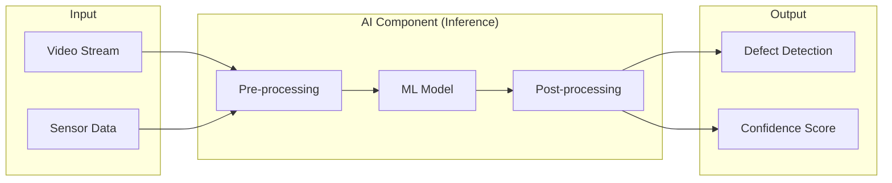

# AI Component Architecture

*partial automatic generator for structural example, please do not take as good proposal, make you own or even comment identified errors, once TP performed, remove this sentence.*

This document describes the architecture of the AI component for the Welding Quality Detection Challenge.

## Overview

The AI component is designed to detect welding defects from visual and sensor data. It consists of a pre-processing pipeline, a deep learning model for defect classification/localization, and a post-processing module for quality reporting.

## 1. Operation Architecture (Inference)
The operation phase describes how the component behaves in a real-time environment.



## 2. Training Architecture
The training phase focuses on model construction and optimization.

```mermaid
graph TD

```

## 3. Evaluation Architecture

The evaluation phase validates the model's performance on unseen data.

```mermaid
graph TD

```

## Software Constituents

- **ML Model_1** : xxx
- **ML Model_2** : xxx
- **ML Model_x** : xxx
- **Pre-processor**: xxx
- **Post-processor**: xxx

### ML Model_1

