# Artefacts and Validation

This document describes how KPIs are aggregated and presented to stakeholders for decision-making across the AI component lifecycle.

## 1. Stakeholders and Artefacts

### 1.1 Operator (Production Line - OP 120)

- **Artefact**: Real-time dashboard displayed on the OP 120 screen for each weld image.
- **Content**:
  - Original image + preprocessed image
  - Final classification (OK / NOK / Unknown) with color-coded indicator (green / red / orange)
  - Confidence score (probability of predicted class)
  - Decision rationale when Unknown (high uncertainty / OOD detected / unusable image)
  - Batch summary: OK/NOK/Unknown counts over the last N welds, trend indicator
- **KPIs used**: confidence scores, OOD score, Unknown rate (batch)
- **Aggregation method**: per-image display (no aggregation), batch summary uses simple counts and moving averages
- **Phase**: Operation

### 1.2 Product Owner

- **Artefact**: Trust synthesis report for deployment go/no-go decision.
- **Content**:
  - Radar chart of the 6 trust attributes (performance, uncertainty, robustness, OOD, generalization, data drift) — immediate visual overview
  - Pass/fail status per attribute against defined thresholds
  - Weighted global trust score for cross-version comparison
  - Go/no-go recommendation
- **KPIs used**: all 13 KPIs aggregated into trust attributes
- **Aggregation method**: two-level approach — (1) pass/fail gate: each attribute must meet its minimum threshold, (2) weighted score: normalized KPIs combined with criticality-based weights (Performance ×3, OOD ×2, Robustness ×2, Uncertainty ×1, Generalization ×1, Drift ×1)
- **Phase**: Evaluation

### 1.3 Quality & Safety Officer

- **Artefact**: Compliance and reliability report.
- **Content**:
  - Confusion matrix per seam type (C20/C33/C102) — detailed error analysis
  - Operational cost matrix — false negative impact weighted by weld criticality
  - Robustness report: ΔF1-score per perturbation type with ODD compliance assessment
  - OOD detection reliability: AUROC OOD, false negative OOD rate
  - Data drift behavior: performance stability curve under increasing degradation
  - Operator correction patterns and missed defect estimates
- **KPIs used**: Performance, Robustness, OOD Monitoring, Data Drift, Sampling Rules Efficiency
- **Aggregation method**: per seam type breakdown, per perturbation type breakdown, criticality weighting for cost matrix
- **Phase**: Evaluation, Operation

### 1.4 Technical Team (Data Scientists / ML Engineers)

- **Artefact**: Detailed technical report for model improvement and production monitoring.
- **Content**:
  - **During development**: training loss curves, F1-score evolution per epoch, train/val gap (overfitting detection), data quality metrics (class distribution, annotation consistency, ODD coverage)
  - **During evaluation**: detailed confusion matrices, ECE and Brier score analysis, per-class and per-seam performance breakdown, robustness curves per perturbation type and intensity level, generalization performance on unseen seams (C19/C34/C101)
  - **During operation**: real-time monitoring dashboard — confidence score distribution, Unknown rate trends, OOD detection frequency, drift indicators, latency tracking, operator feedback log
- **KPIs used**: all 13 KPIs at full granularity
- **Aggregation method**: no aggregation for development/evaluation (raw metrics), moving averages and trend detection for operation monitoring
- **Phase**: Training, Evaluation, Operation

### 1.5 Routing & Preprocessing Report (Technical Team)

- **Artefact**: Detailed analysis of the routing and preprocessing pipeline behavior.
- **Content**:
  - Routing confusion matrix (true seam type vs assigned CNN)
  - Routing accuracy per seam type
  - Per-CNN performance comparison (F1-score, Recall NOK side by side for C20/C33/C102)
  - Cross-CNN performance gap trend over time
  - Unblur/un-rotate impact analysis (ΔF1 with/without, image quality before/after)
  - Blur classification accuracy report
- **KPIs used**: Routing Accuracy, Per-CNN Performance, Blur Detection Quality, Preprocessing Correction Quality
- **Aggregation method**: per seam type breakdown, before/after comparison
- **Phase**: Evaluation, Operation

### 1.6 Operator Efficiency Report (Product Owner / Quality Officer)

- **Artefact**: Analysis of operator interaction effectiveness and sampling rules relevance.
- **Content**:
  - Operator correction rate (how often the operator overrides the system)
  - Correction patterns (which seam types / conditions trigger the most corrections)
  - Missed defect estimates from batch control
  - Operator workload metrics (images reviewed per shift)
  - Recommendations for sampling rules adjustment
- **KPIs used**: Sampling Rules Efficiency, Performance (via batch control)
- **Aggregation method**: per shift / per seam type aggregation, trend analysis
- **Phase**: Operation

## 2. Artefact Mapping to Lifecycle Phases

| Artefact | Construction | Training | Evaluation | Operation |
|----------|:---:|:---:|:---:|:---:|
| Operator Dashboard | | | | X |
| Trust Synthesis (Product Owner) | | | X | |
| Compliance Report (Quality/Safety) | | | X | X |
| Technical Report (Data/ML Team) | X | X | X | X |
| Routing & Preprocessing Report | | | X | X |
| Operator Efficiency Report | | | | X |

## 3. Visual Representation

```mermaid
graph TD
    subgraph "KPIs"
        DQ[Data Quality]
        TC[Training Convergence]
        PERF[Performance]
        UNC[Uncertainty]
        ROB[Robustness]
        OOD[OOD Monitoring]
        GEN[Generalization]
        DRIFT[Data Drift]
        ROUT[Routing Accuracy]
        BLUR[Blur Detection Quality]
        PCNN[Per-CNN Performance]
        PCOR[Preprocessing Correction]
        SAMP[Sampling Rules Efficiency]
    end

    subgraph "Artefacts"
        OP_DASH[🖥️ Operator Dashboard\nreal-time per-image display]
        PO_REPORT[📊 Trust Synthesis\nradar chart + go/no-go]
        QA_REPORT[📋 Compliance Report\ncost matrix + robustness]
        TECH_REPORT[🔧 Technical Report\nfull metrics + monitoring]
        ROUT_REPORT[⚙️ Routing & Preprocessing\nper-CNN comparison]
        OP_EFF[👤 Operator Efficiency\ncorrection patterns]
    end

    PERF --> OP_DASH
    UNC --> OP_DASH
    OOD --> OP_DASH

    DQ --> PO_REPORT
    TC --> PO_REPORT
    PERF --> PO_REPORT
    UNC --> PO_REPORT
    ROB --> PO_REPORT
    OOD --> PO_REPORT
    GEN --> PO_REPORT
    DRIFT --> PO_REPORT
    ROUT --> PO_REPORT
    PCNN --> PO_REPORT

    PERF --> QA_REPORT
    ROB --> QA_REPORT
    OOD --> QA_REPORT
    DRIFT --> QA_REPORT
    SAMP --> QA_REPORT

    DQ --> TECH_REPORT
    TC --> TECH_REPORT
    PERF --> TECH_REPORT
    UNC --> TECH_REPORT
    ROB --> TECH_REPORT
    OOD --> TECH_REPORT
    GEN --> TECH_REPORT
    DRIFT --> TECH_REPORT

    ROUT --> ROUT_REPORT
    BLUR --> ROUT_REPORT
    PCNN --> ROUT_REPORT
    PCOR --> ROUT_REPORT

    SAMP --> OP_EFF
    PERF --> OP_EFF

    style DQ fill:#4A90D9,stroke:#2C5F8A,color:#fff
    style TC fill:#4A90D9,stroke:#2C5F8A,color:#fff
    style PERF fill:#4A90D9,stroke:#2C5F8A,color:#fff
    style UNC fill:#4A90D9,stroke:#2C5F8A,color:#fff
    style ROB fill:#4A90D9,stroke:#2C5F8A,color:#fff
    style OOD fill:#4A90D9,stroke:#2C5F8A,color:#fff
    style GEN fill:#4A90D9,stroke:#2C5F8A,color:#fff
    style DRIFT fill:#4A90D9,stroke:#2C5F8A,color:#fff
    style ROUT fill:#4A90D9,stroke:#2C5F8A,color:#fff
    style BLUR fill:#4A90D9,stroke:#2C5F8A,color:#fff
    style PCNN fill:#4A90D9,stroke:#2C5F8A,color:#fff
    style PCOR fill:#4A90D9,stroke:#2C5F8A,color:#fff
    style SAMP fill:#4A90D9,stroke:#2C5F8A,color:#fff
    style OP_DASH fill:#8E44AD,stroke:#6C3483,color:#fff
    style PO_REPORT fill:#F39C12,stroke:#D68910,color:#fff
    style QA_REPORT fill:#E74C3C,stroke:#C0392B,color:#fff
    style TECH_REPORT fill:#2ECC71,stroke:#27AE60,color:#fff
    style ROUT_REPORT fill:#2ECC71,stroke:#27AE60,color:#fff
    style OP_EFF fill:#F39C12,stroke:#D68910,color:#fff
```

## 4. Phase Usage Summary

- **Construction**: data quality reports (class distribution, annotation consistency, ODD coverage)
- **Training**: loss curves, F1 evolution, overfitting detection (train/val gap)
- **Evaluation**: trust synthesis (radar chart), compliance report (confusion matrices, cost matrix, robustness curves), routing & preprocessing analysis, go/no-go decision
- **Operation**: real-time operator dashboard, continuous monitoring (confidence trends, Unknown rate, OOD frequency, drift detection), operator efficiency tracking, batch control
